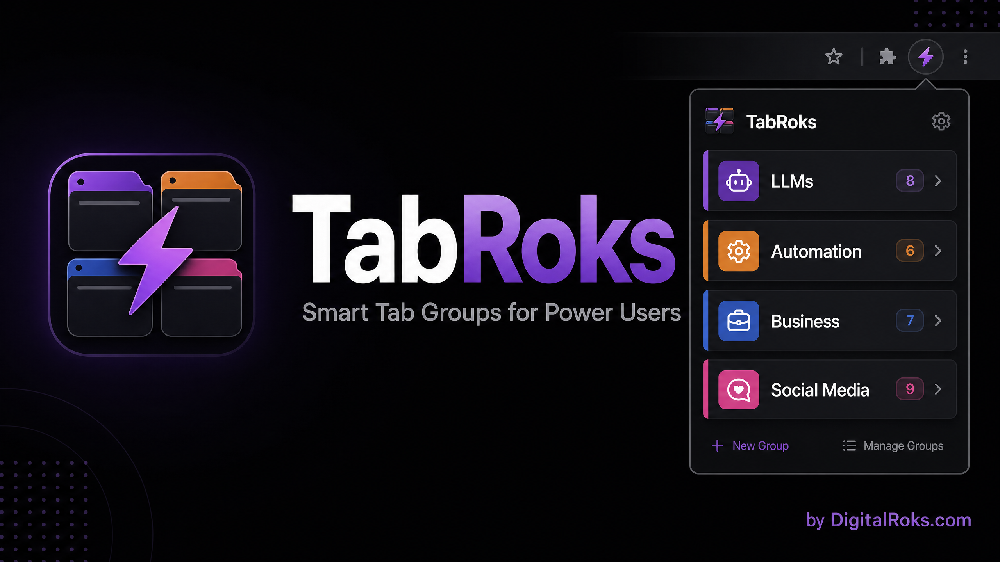

# ⚡ TabRoks — Smart Tab Groups for Chrome



> **Stop drowning in browser tabs. One click. Zero clutter.**
> TabRoks automatically organizes your open Chrome tabs into smart, color-coded groups — so you can focus on what matters.

[](LICENSE)
[](https://chrome.google.com/webstore)
[](https://digitalroks.com)
[](https://github.com/timmiller99/tabroks)

---

## 🚀 What It Does

TabRoks scans every open tab in your Chrome window and instantly groups them by category — color-coded, labeled, and collapsible. No configuration required.

| Category | Color | Examples |
|---|---|---|
| 🤖 LLMs | Purple | Claude, ChatGPT, Gemini, Grok, Genspark, Manus, Perplexity |
| ⚡ Automation | Orange | Zapier, Make, n8n, Notion, Airtable, Vercel |
| 💼 Business | Blue | DigitalRoks, QuickBooks, Stripe, Shopify, Yelp |
| 📣 Marketing & SEO | Green | SEMrush, Google Ads, Mailchimp, Canva, HubSpot |
| 📱 Social Media | Pink | Facebook, Instagram, X/Twitter, LinkedIn, TikTok |
| 💻 Dev & Code | Cyan | GitHub, Stack Overflow, CodePen, AWS, Supabase |
| 🔍 Research | Yellow | Google, Wikipedia, Medium, Hacker News, Product Hunt |
| 🛒 Shopping | Red | Amazon, eBay, Home Depot, Etsy |

---

## 📦 Installation (Developer Mode — Free, No Store Required)

1. **Download** this repo as a ZIP → click the green **Code** button → **Download ZIP**
2. **Unzip** the folder anywhere on your computer
3. Open Chrome and go to `chrome://extensions`
4. Toggle **Developer Mode** ON (top-right corner)
5. Click **Load unpacked** and select the unzipped `tabroks` folder
6. The TabRoks icon will appear in your Chrome toolbar — **pin it** for easy access!

> **Note:** The extension only requires `tabs`, `tabGroups`, and `storage` permissions. It never reads your tab content, sends data anywhere, or tracks your browsing.

---

## 🎯 How to Use

1. Click the **TabRoks icon** in your Chrome toolbar
2. See a live preview of how your tabs will be categorized
3. Click **⚡ Auto-Group All Tabs** — done in under a second
4. To reset, click **✕ Ungroup All**

That's it. No accounts. No subscriptions. No data collection.

---

## 🛠 Customizing Categories

Want to add your own categories or domains? Open `src/categories.js` and edit the `CATEGORIES` array:

```javascript
{
  name: "🏠 My Business",
  color: "blue",          // Options: grey, blue, red, yellow, green, pink, purple, cyan, orange
  patterns: [
    "mybusiness.com",
    "mycrm.io",
    "invoicing-tool.com"
  ]
}
```

Save the file, go to `chrome://extensions`, and click the **refresh icon** on TabRoks. Your new category is live.

---

## 📁 Project Structure

```
tabroks/
├── manifest.json          # Chrome Extension Manifest V3
├── popup.html             # Extension popup UI
├── popup.css              # Dark theme styles
├── popup.js               # Popup controller
├── src/
│   ├── background.js      # Service worker — core grouping logic
│   └── categories.js      # Category definitions (edit this to customize)
├── icons/
│   ├── icon16.png
│   ├── icon32.png
│   ├── icon48.png
│   └── icon128.png
└── README.md
```

---

## 🔒 Privacy

TabRoks is **100% local**. It:
- ✅ Only reads tab URLs and titles (to categorize them)
- ✅ Never sends any data to any server
- ✅ Requires no account or login
- ✅ Has no analytics or tracking
- ✅ Works entirely offline

---

## 🤝 Contributing

Pull requests are welcome! If you want to add new category patterns, improve the UI, or add features like:
- Custom user-defined categories (saved to `chrome.storage`)
- Auto-group on startup
- Keyboard shortcut support
- Import/export category configs

Open an issue or submit a PR.

---

## 📄 License

MIT License — free to use, modify, and distribute. See [LICENSE](LICENSE) for details.

---

## 🌐 Built by DigitalRoks

TabRoks is a free tool from **[DigitalRoks.com](https://digitalroks.com)** — your hub for AI tools, workflows, and resources for entrepreneurs and business owners.

> 🚀 **[Explore more free AI tools → DigitalRoks.com](https://digitalroks.com)**

---

*If TabRoks saves you time, give it a ⭐ on GitHub — it helps others find it!*
